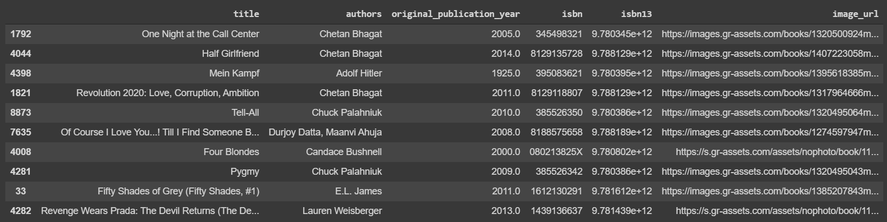

# 10k Book Recommender
This project is a book recommender system which makes use of machine learning to determine what books a user
would like based on those that they have previously rated. It is written in Python and created with various libraries such
as Numpy and TensorFlow, a deep learning framework which is used to develop and train machine learning models.

